# Group Policy Management Lab – Configure and Enforce GPOs with Active Directory

## Project Summary

This lab builds on an existing Active Directory environment to demonstrate how Group Policy Objects (GPOs) are created, configured, linked, and verified in a Windows Server domain. Two GPOs were created: a password policy applied to the IT Department OU, and a Control Panel restriction applied domain-wide. Policies were tested and confirmed working on a Windows 11 domain-joined client machine.

This project simulates real-world IT administration tasks that help desk and sysadmin teams perform to enforce security standards and restrict user access across an organization.

---

## Environments and Technologies Used

- Oracle VirtualBox
- Windows Server 2019 (Domain Controller — DC-1)
- Windows 11 Enterprise (Client — Client-1)
- Group Policy Management Console (GPMC)
- Group Policy Management Editor
- Active Directory Domain Services (AD DS)
- Command Prompt (`gpupdate /force`)

---

## Prerequisites

This lab was built on top of the Active Directory Home Lab project. The following were already in place:

- Domain: `mydomain.com`
- Domain Controller: DC-1 (Windows Server 2019)
- Client machine: Client-1 (Windows 11) joined to the domain
- OUs: IT-Department, HR-Department, Finance-Department
- Domain user: Solomon Yohanis (member of IT-Department)

---

## Lab Objectives

1. Open Group Policy Management on the Domain Controller
2. Create a Password Policy GPO linked to the IT-Department OU
3. Configure password rules — minimum length, complexity, and expiration
4. Create a Control Panel restriction GPO linked to the entire domain
5. Enable the "Prohibit access to Control Panel" policy setting
6. Force policy update on the client machine
7. Verify the Control Panel restriction is working on Client-1

---

## Step 1 – Open Group Policy Management Console

On DC-1, Group Policy Management was opened via **Server Manager → Tools → Group Policy Management**.

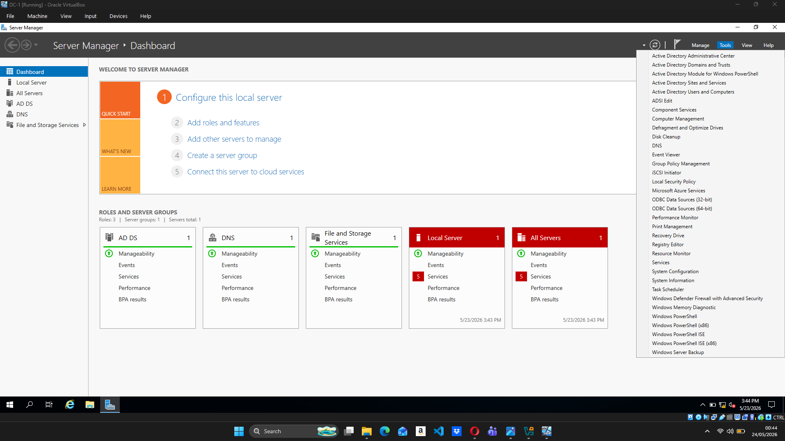
*Server Manager Tools menu showing Group Policy Management option*

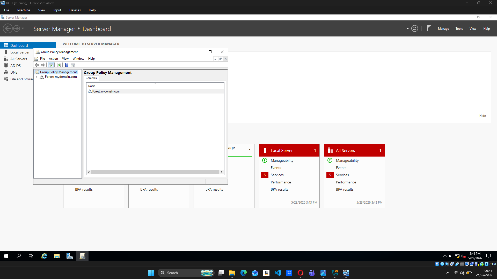
*Group Policy Management console open showing Forest: mydomain.com*

The forest was expanded to reveal the domain structure including all three OUs.

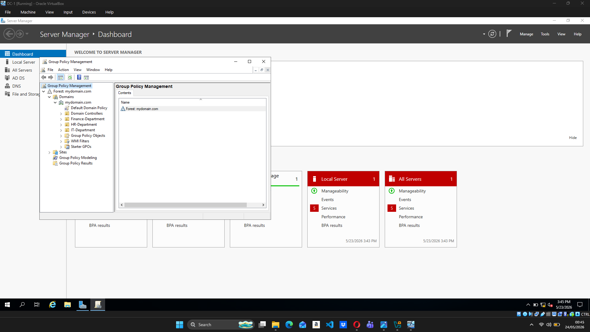
*GPMC showing mydomain.com expanded with IT-Department, HR-Department, and Finance-Department OUs*

---

## Step 2 – Create the IT Password Policy GPO

Right-clicking on the **IT-Department** OU revealed the option to create and link a new GPO directly to that OU.

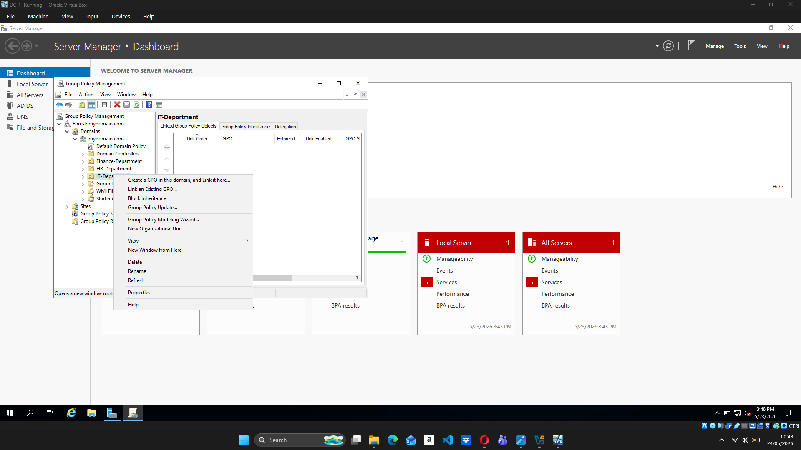
*Right-clicking IT-Department OU to create a new linked GPO*

The GPO was named `IT-Password-Policy`.

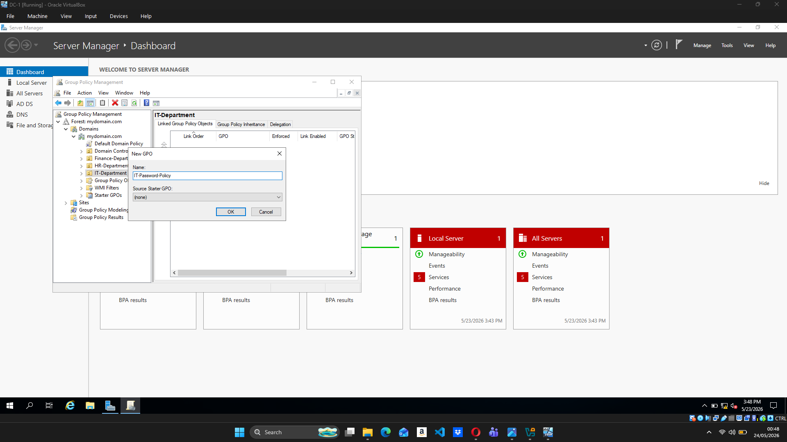
*New GPO dialog — naming the policy IT-Password-Policy*

The GPO was created and appeared linked to IT-Department with Link Enabled: Yes.

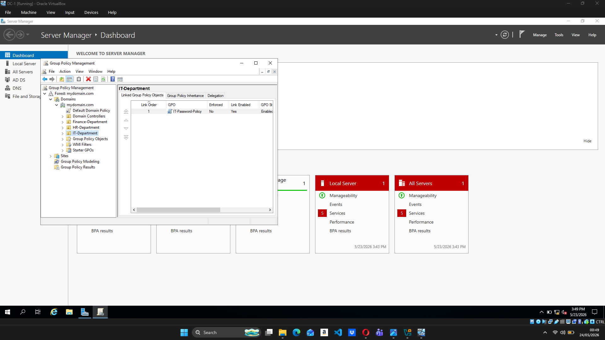
*IT-Password-Policy linked to IT-Department OU — Link Enabled: Yes*

The scope of the GPO confirmed it was linked to IT-Department and applied to Authenticated Users.

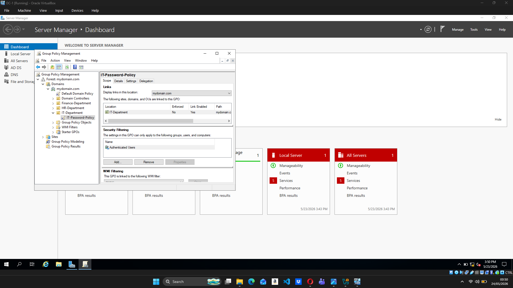
*IT-Password-Policy scope showing link to IT-Department and Authenticated Users*

---

## Step 3 – Configure Password Policy Settings

The GPO was edited by right-clicking and selecting **Edit**, opening the Group Policy Management Editor. The path navigated to:

**Computer Configuration → Policies → Windows Settings → Security Settings → Account Policies → Password Policy**

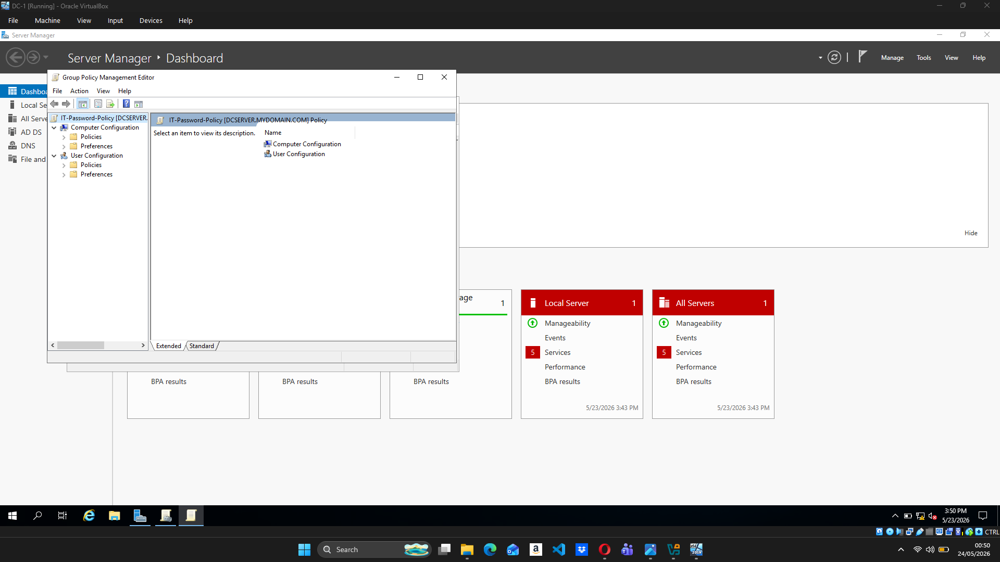
*Group Policy Management Editor open for IT-Password-Policy*

The Password Policy settings were initially all "Not Defined".

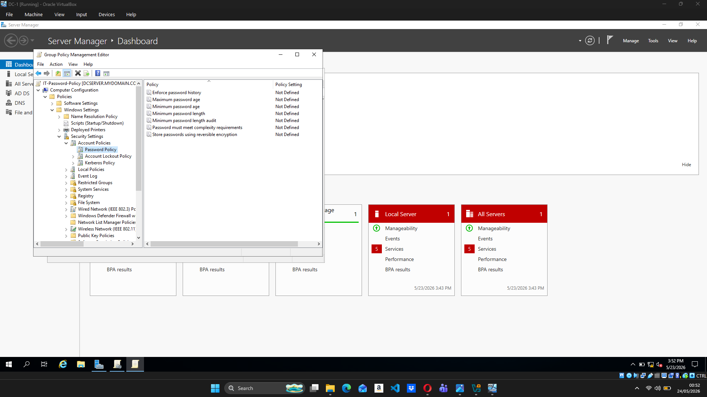
*Password Policy settings before configuration — all Not Defined*

Each setting was double-clicked and configured. The final settings:

| Policy | Value |
|---|---|
| Maximum password age | 90 days |
| Minimum password age | 30 days |
| Minimum password length | 8 characters |
| Password must meet complexity requirements | Enabled |

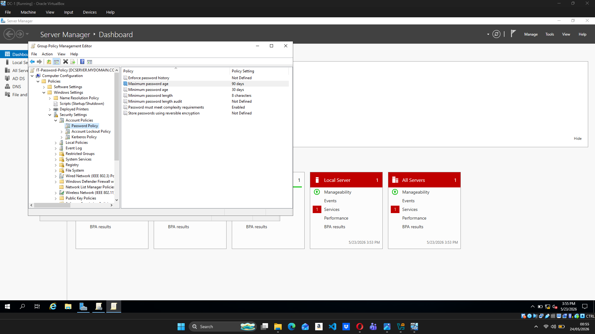
*Password Policy fully configured — complexity enabled, length 8 chars, max age 90 days*

---

## Step 4 – Create the Disable Control Panel GPO

A second GPO was created linked to **mydomain.com** (the domain root) so it applies to all users across all OUs.

*Creating Disable-Control-Panel GPO linked to mydomain.com*

After creation, the domain showed both GPOs linked and enabled.

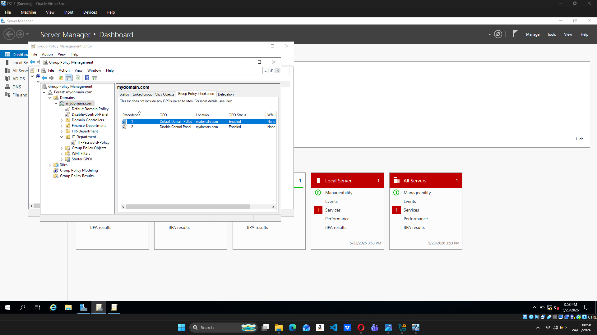
*mydomain.com showing Default Domain Policy and Disable-Control-Panel — both Enabled*

---

## Step 5 – Enable the Control Panel Restriction

Inside the **Disable-Control-Panel** GPO editor, the path navigated to:

**User Configuration → Policies → Administrative Templates → Control Panel**

The setting "Prohibit access to Control Panel and PC Settings" was found and opened.

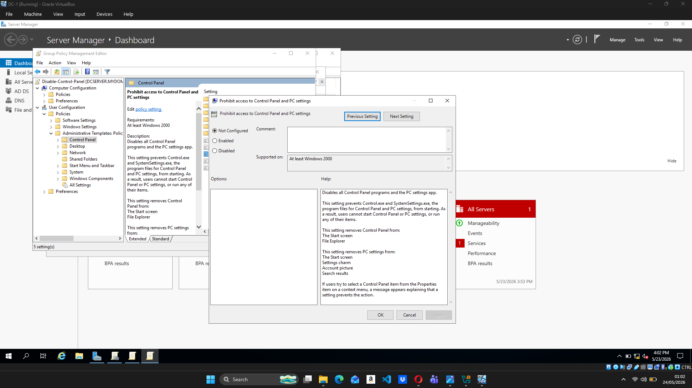
*"Prohibit access to Control Panel and PC settings" — Not Configured (before)*

The setting was changed to **Enabled** and applied.

*"Prohibit access to Control Panel and PC settings" — Enabled (after)*

---

## Step 6 – Apply Policies on Client-1

Client-1 was logged into as domain user **Solomon Yohanis**.

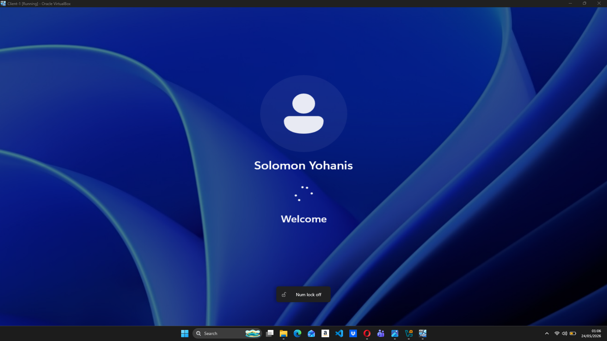
*Client-1 logging in as domain user Solomon Yohanis*

The Run dialog was used to open Command Prompt.

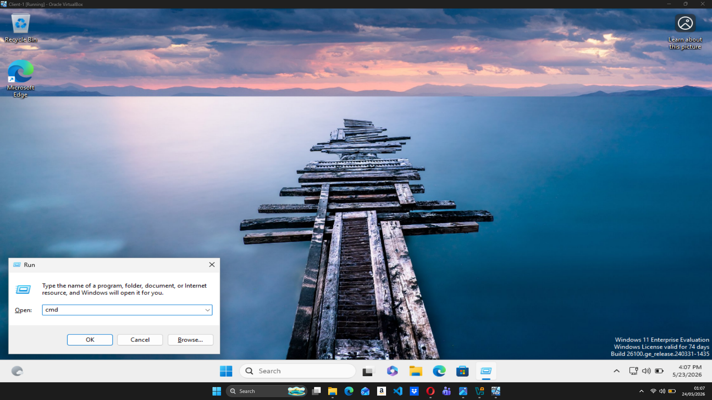
*Using Run → cmd to open Command Prompt on Client-1*

`gpupdate /force` was run to immediately pull and apply the latest GPOs from the Domain Controller.

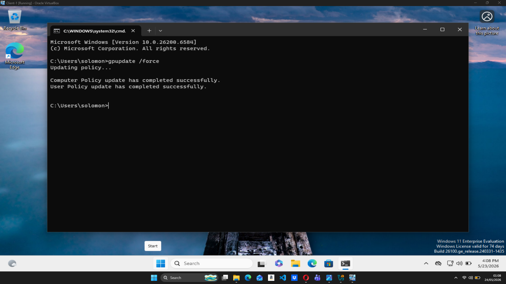
*gpupdate /force completing successfully — Computer and User Policy both updated*

---

## Step 7 – Verify GPO is Working

After the policy update, Control Panel was searched in the Start menu and opened — triggering the GPO restriction.

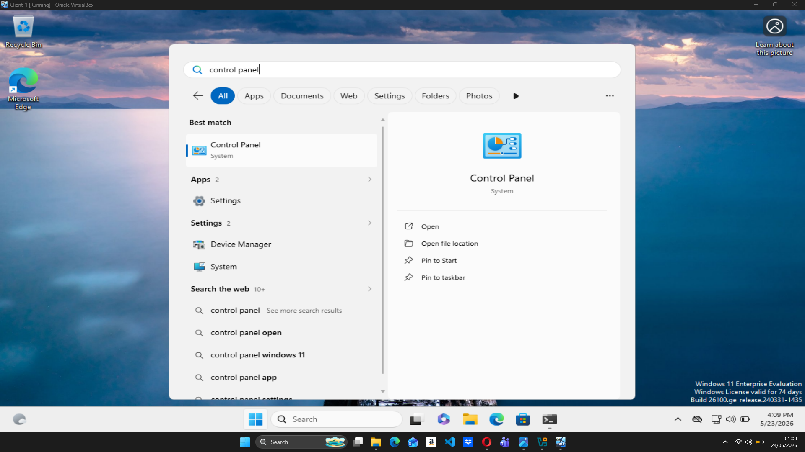
*User attempts to open Control Panel on Client-1*

The restriction message appeared immediately confirming the GPO is active and enforced.

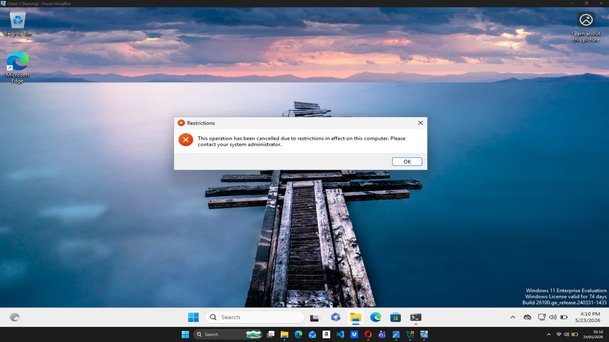
*"This operation has been cancelled due to restrictions in effect on this computer. Please contact your system administrator." — GPO verified ✅*

---

## Key Takeaways

- Used Group Policy Management Console to create and manage GPOs in an Active Directory domain
- Created a scoped password policy targeting only the IT-Department OU, enforcing password length, complexity, and expiration rules
- Created a domain-wide restriction blocking all users from accessing Control Panel and PC Settings
- Used `gpupdate /force` to immediately apply policies without waiting for the default refresh interval
- Verified policy enforcement on a live domain-joined Windows 11 client machine
- Demonstrated understanding of GPO scope — OU-level vs domain-level policy application

---

*Lab completed: May 2026 | Author: Solomon Yohanis*
